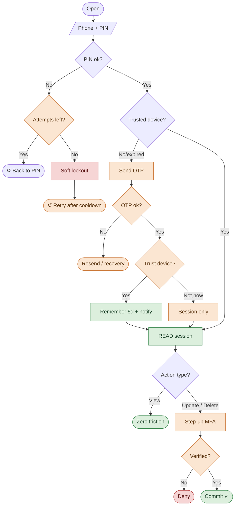

# Farm Advising Web — Authentication Flow

One central path, top to bottom. Each decision feeds the next state on a straight line.
Failure and loop-back cases end in a rounded marker (↺ = returns to an earlier step) so no lines cross the main flow.

After a correct OTP the user is asked **"Trust this device?"** (Facebook-style). Choosing **yes** remembers the
device for **5 days** — no OTP for login or normal use in that window. Sensitive config changes still require
step-up even on a trusted device.

**Legend:** green = frictionless / success · orange = step-up & recovery · red = blocked

**The 5-day trust window:** removes OTP at login and for all low-risk use while active. It does **not** bypass the
step-up gate — updating farm data, changing the registered number, or deleting the account always re-prompts for MFA, trusted device or not.
When the window expires, the next login re-sends an OTP and asks "Trust this device?" again.

**Also handled (kept out of the diagram to keep it clean):** forgot PIN → reset via OTP; lost SIM / number change →
field-officer or knowledge-based recovery, then re-bind; "Not now" or public/shared devices are never remembered.
Guardrails throughout: PIN attempt lockout, OTP rate-limiting, and an SMS alert whenever a new device is trusted.
