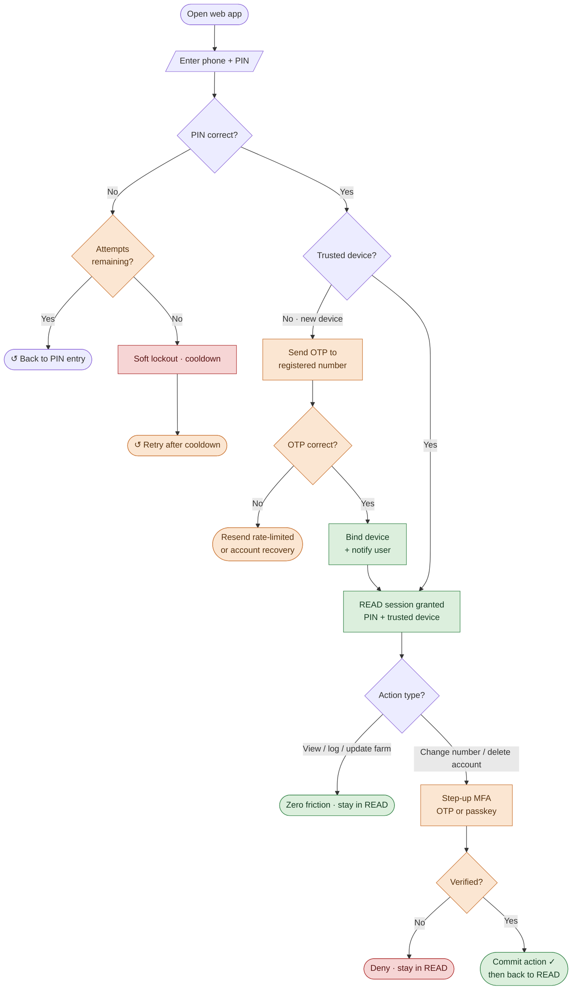

# Farm Advising Web — Authentication Flow

One central path, top to bottom. Each decision feeds the next state on a straight line.
Failure and loop-back cases end in a rounded marker (↺ = returns to an earlier step) so no lines cross the main flow.

**Legend:** green = frictionless / success · orange = step-up & recovery · red = blocked

**Also handled (kept out of the diagram to keep it clean):** forgot PIN → reset via OTP; lost SIM / number change → field-officer or knowledge-based recovery, then re-bind; session expiry → re-a[...]